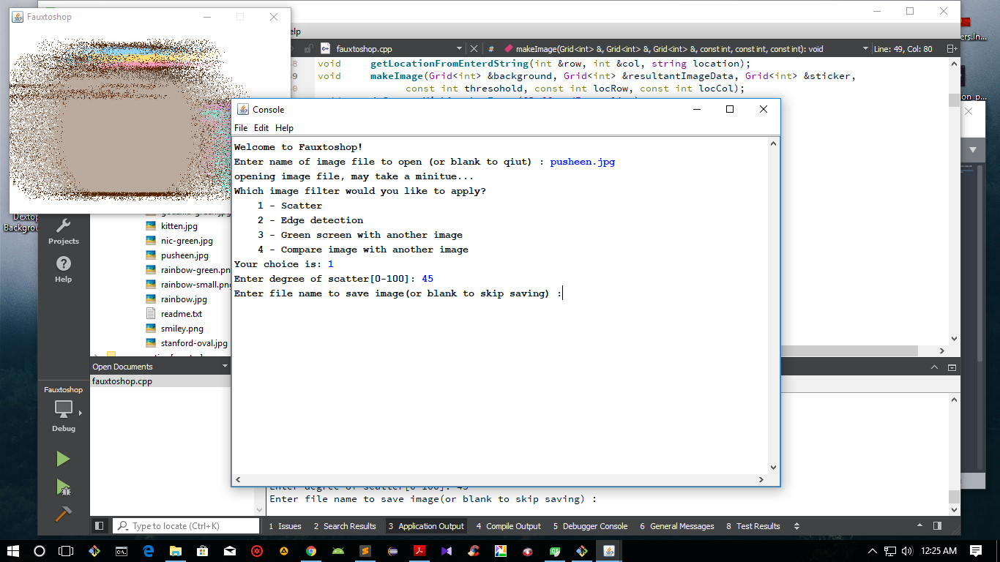
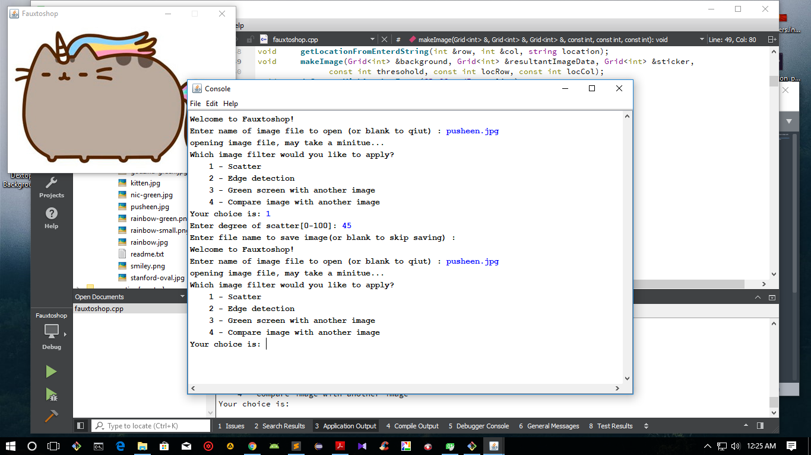
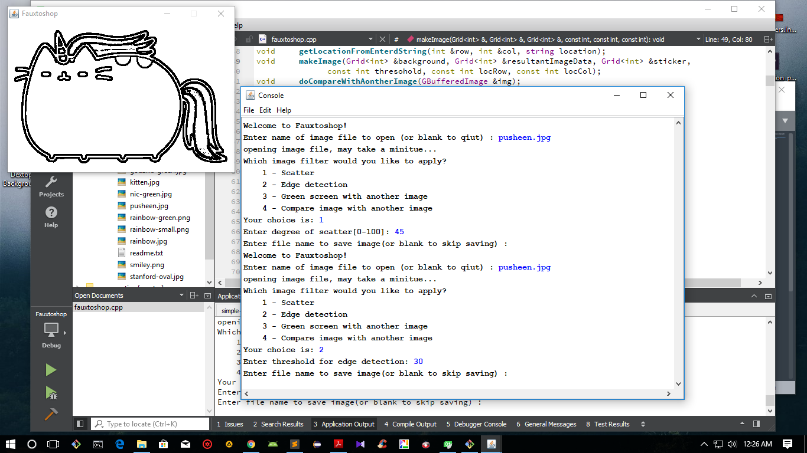
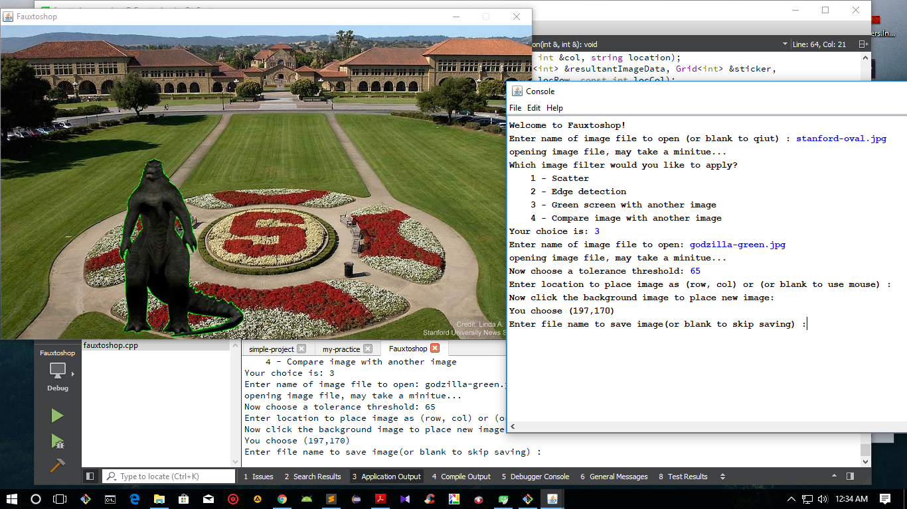
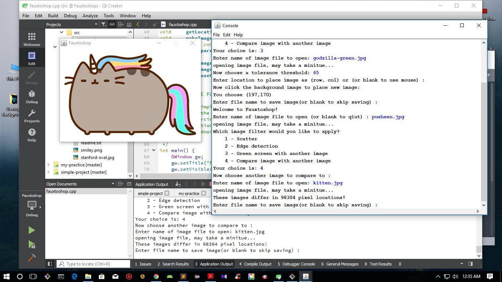

# CS-106B Fauxtoshop

Its a simple photoshop with four image editting effect- Scattering, Edge detection, Green screen with another image, Compare image with another image.

This project was used to complete one of the Stanford [CS106B](http://web.stanford.edu/class/archive/cs/cs106b/cs106b.1162/lectures.shtml) Assignment. Starter code was given by course liders.

Pre-requisites
--------------

- STANFORD C++ Library
- JDK 1.6 or higher

Screen shots
--------------

  

  

  

  

  

## Note

### If you are a Stanford CS106B student, please don't see the code.

By seeing the code will be violating the Stanford Honor code rules.